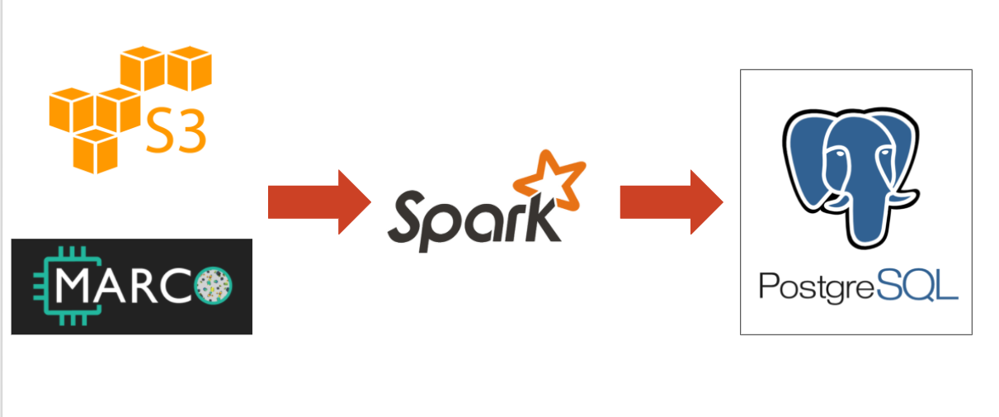
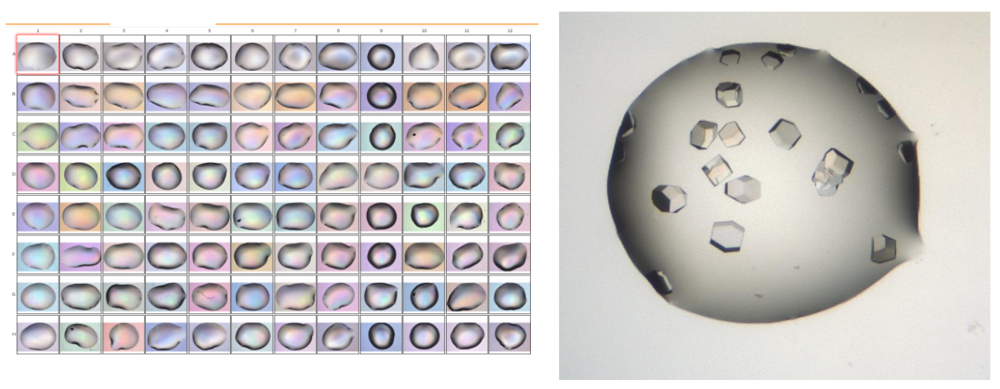

# Crystal-Base

Crystal-Base is an image classification pipeline that reports whether or not an image contains a protein crystal. Crystal-Base caters towards both academic and industrial researchers who are running large scale HTS protein crystallization projects who do not want to spend time on the mundane task of identifying possible protein crystals from their crystallization screens.

With Crystal-base I decided to use a transfer learning and the [inceptionv3](https://www.tensorflow.org/tutorials/images/image_recognition) training model to identify protein drop crystals from the [Marco Database](https://marco.ccr.buffalo.edu/).

# Architecture

/
# Dataset
All protein crystal data was obtained from the [Marco Database](https://marco.ccr.buffalo.edu/)

